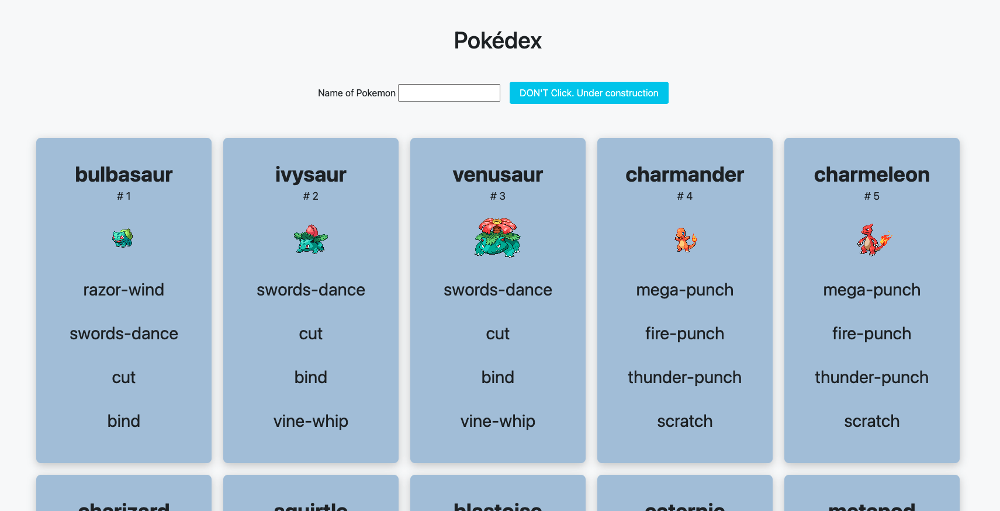

# AJAX Pokédex

[Javascript exercise at BeCode](https://github.com/becodeorg/ANT-Giertz-4.30/tree/master/1.The-Field/js/ajax-pokedex)

in May 2021

Practice using API and fetching the data.
It was one of the most challenging exercises of Javascript for me at that moment, since I didn't have any knowledge about AJAX before. 

### Need to fix
- Searching function (with name or ID)
- Show only the results from the search

https://mari-mizutani.github.io/ajax-pokedex/

